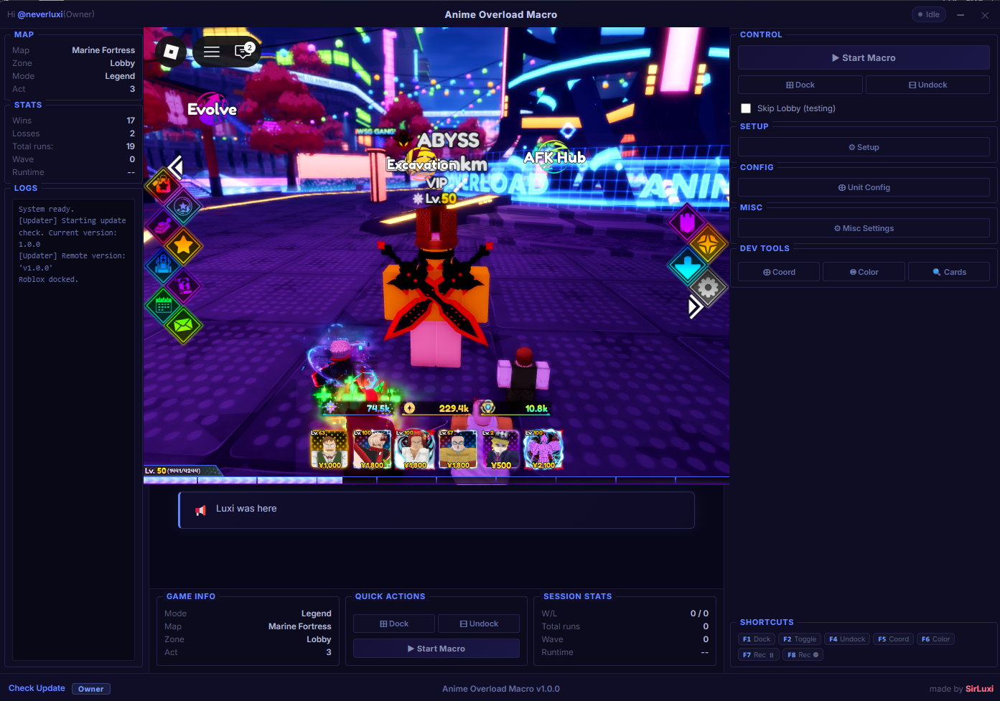

<div align="center">

# ⚔️ Anime Overload Macro

[](../../releases/latest)
[](../../releases/latest)
[](#)

**The only macro you'll ever need for Anime Overload.**  
A fully automated, vision-powered farming macro with a premium desktop UI — built to handle everything while you do nothing.

</div>

---

<!-- Replace the line below with your actual screenshot once uploaded (see the Screenshot Guide section) -->
<!--  -->

---

## ✨ Core Features

### 🧠 Vision-Based Intelligence
Powered by **OpenCV**, the macro sees and understands the game — detecting waves, unit states, challenge triggers, and UI prompts in real time. No pixel-perfect screen anchoring. No brittle clicking. It just works.

### 🖥️ Seamless Window Docking
Roblox gets pulled directly **inside** the macro UI. Borders are stripped, the window is anchored to the center panel, and a keep-alive thread holds it perfectly in place — even if you move the app. Your desktop stays clean, and you keep full access to both panels at all times.

### 🔄 Automatic Reconnect System
Disconnected? Game crashed? The macro **handles it automatically** — detects the reconnect screen, closes the dead instance, relaunches Roblox, and drops straight into your private server without you lifting a finger.

### 🎥 Smart Placement Recorder
Point-and-click recording of unit positions, paths, and actions for any map. Recordings are saved as named configs that can be imported, exported, and swapped on the fly. One profile per map — or per challenge.

### 📊 Live Stats & Discord Webhooks
Every run is tracked: wins, losses, total runs, wave count, and session runtime — all visible live in the UI. Optionally pipe run results to any **Discord channel** via webhook for logging or sharing progress.

### ⚡ One-Click Over-The-Air Updates
No re-downloading the installer. When a new version drops, the app shows a banner and lets you update with a single click. Forced updates ensure everyone stays on the latest patch.

### 🛡️ License & HWID System
Access is gated by a license key tied to your hardware ID. Once verified, your key is cached locally — you only need to enter it once.

---

## 🚀 Getting Started

### Installation
1. Go to the [**Releases**](../../releases/latest) tab
2. Download `anime-overload-setup.msi`
3. Run the installer — if Windows Defender warns you, click **More info → Run anyway** (this is normal for new indie apps without an EV certificate)
4. Launch the app and open Roblox

### Usage
1. Load into **Anime Overload** in Roblox
2. Click **Dock** (or press `F1`) to attach the Roblox window into the macro UI
3. Select your **Map**, **Mode**, and **Act** in the left panel
4. Press **Start Macro** — and step away

| Hotkey | Action |
|--------|--------|
| `F1` | Dock Roblox |
| `F2` | Toggle Macro On/Off |
| `F4` | Undock Roblox |

---

## 📸 Screenshot Guide

To add a screenshot to this README:

1. Take a screenshot of the running app (Win + Shift + S, or Snipping Tool)
2. Save it as `screenshot.png`
3. In your GitHub repository, create a folder called `assets/` in the root
4. Upload `screenshot.png` into that `assets/` folder via the GitHub web UI (drag & drop works)
5. Uncomment this line at the top of this README:
   ```
   
   ```
6. Commit — the screenshot will now appear on the page

> **Tip:** For the best result, take the screenshot with Roblox docked and the macro running so it shows the full UI in action.

---

<div align="center">

*Built by SirLuxi*

</div>
